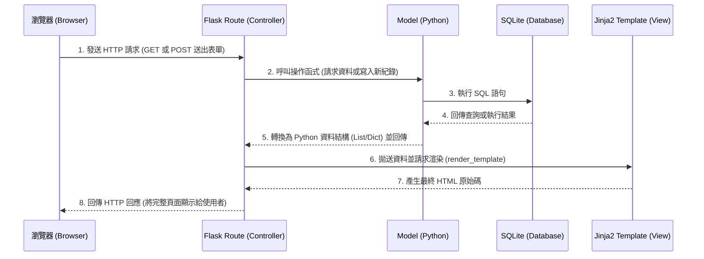

# 系統架構設計 (System Architecture)

## 1. 技術架構說明

### 選用技術與原因
本專案採用輕量級但功能齊全的技術組合，以快速建立並驗證「讀書筆記本系統」的 MVP (Minimum Viable Product)。
- **後端框架：Python + Flask**
  - **原因**：Flask 是一個微型 Web 框架，學習曲線平緩，對小型專案來說非常敏捷。適合快速開發路由與串接資料庫。
- **模板引擎：Jinja2**
  - **原因**：與 Flask 緊密整合，能輕易地將後端資料注入渲染為 HTML，無需額外建立前後端分離的架構，能有效降低初期開發的複雜度與維護成本。
- **資料庫：SQLite**
  - **原因**：無須繁瑣的資料庫伺服器架設設定，資料儲存為單一檔案，非常適合本專案初期輕量級存取的性質。搭配 `sqlite3` 提供簡潔安全的存取方式。

### Flask MVC 模式說明
本專案採用類似 MVC (Model-View-Controller) 的概念來組織程式碼，以保持架構清晰：
- **Model (模型)**：負責與 SQLite 資料庫互動，封裝針對書籍、心得、評分與留言的新增、查詢、修改與刪除的邏輯。
- **View (視圖)**：由 Jinja2 HTML 模板負責，將處理好的資料呈現給使用者（包含首頁清單、表單頁面等）。
- **Controller (控制器)**：由 Flask Route 負責，接收瀏覽器的請求，處理商業邏輯、呼叫 Model 取得資料，最後將資料交給 View 進行渲染並回傳給用戶。

---

## 2. 專案資料夾結構

以下為本系統建議的資料夾樹狀圖與用途說明：

```text
web_app_development2/
├── app/
│   ├── models/           ← 資料庫模型 (處理對 SQLite 的存取邏輯)
│   │   ├── __init__.py
│   │   └── database.py   ← 定義與資料庫通訊的工具函式
│   ├── routes/           ← Flask 路由 (Controller)
│   │   ├── __init__.py
│   │   └── book_routes.py← 書籍、心得、搜尋與留言功能的路由
│   ├── templates/        ← Jinja2 HTML 模板 (View)
│   │   ├── base.html     ← 共用版型 (包含導覽列與 footer，引入共同 CSS)
│   │   ├── index.html    ← 首頁 (列出書籍與心得列表)
│   │   ├── create.html   ← 新增書籍/心得與填寫評分的表單頁面
│   │   └── detail.html   ← 單一書籍詳情與留言互動區塊頁面
│   └── static/           ← 靜態資源檔案
│       ├── css/
│       │   └── style.css ← 負責客製化的網站樣式設計
│       └── js/
│           └── main.js   ← 負責前端互動邏輯 (如有需要)
├── instance/             ← 放置敏感或運行時自動產生的檔案
│   └── database.db       ← SQLite 資料庫檔案
├── docs/                 ← 專案說明文件管理區
│   ├── PRD.md            ← 產品需求文件
│   └── ARCHITECTURE.md   ← 本系統架構文件
├── app.py                ← 應用程式入口點 (初始化 Flask，註冊 Route)
└── requirements.txt      ← Python 套件依賴清單
```

---

## 3. 元件關係圖

透過 Jinja2 結合 Flask 的後端渲染 (Server-Side Rendering) 架構，資料流與使用者請求過程如下圖所示：



---

## 4. 關鍵設計決策

1. **不採用前後端分離，統一使用 Jinja2 渲染網頁**：
   - **原因**：身為 MVP，最大的重點在於快速構建核心功能與驗證想法。使用 Jinja2 加上 Vanilla CSS，免去搭建 API 以及設定 React/Vue 環境與狀態管理的時間。開發團隊能將心力專注在核心功能的串接，加速產品問世。
2. **SQLite 作為唯一且主要的資料存儲庫**：
   - **原因**：對於初期的讀書筆記與分享平台，資料庫存取量和並發讀寫不會面臨巨大瓶頸。SQLite 輕量、免設定網路權限且儲存為單一檔案的特性，極大地降低了開發難度與部署門檻。
3. **資料庫存取層集中化管理 (models 資料夾)**：
   - **原因**：避免將繁雜的 SQL 語句直接撰寫在 Flask 的路由函式中，而是抽出並封裝在 `app/models/`。這能帶來更好的代碼可讀性與可維護性。未來一旦遭遇效能瓶頸或其他資料庫擴展考量（如升級至 PostgreSQL 或導入 SQLAlchemy），只需修改底層 Model 設計即可，不影響上游商業邏輯。
4. **預設的安全過濾機制防範基礎攻擊**：
   - **原因**：本平台開放使用者自由輸入心得與留言。為了確保系統安全，資料庫的寫入一律規範使用「參數化查詢 (Parameterized Query)」以阻絕 SQL Injection。而在前端呈現層方面，則倚靠 Jinja2 預設的自動跳脫功能預防常見的 XSS (Cross-Site Scripting) 攻擊，提供使用者安全的互動環境。
