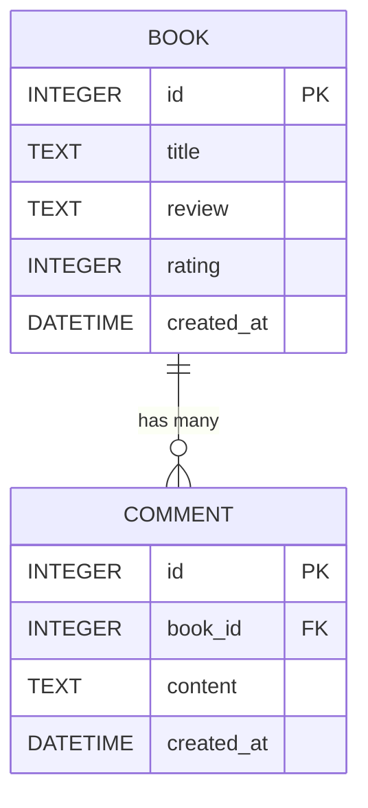

# DB Design (資料庫設計)

## 1. ER 圖（實體關係圖）

本系統的主要資料儲存需求圍繞在「書籍與心得」以及針對該心得的「留言」。

---

## 2. 資料表詳細說明

### `books` 資料表
儲存使用者所建立的書籍資訊與讀書心得。
- **`id`** (`INTEGER`): 主鍵 (Primary Key)，自動遞增的唯一識別碼。
- **`title`** (`TEXT`): 書籍名稱，必填字串。
- **`review`** (`TEXT`): 使用者的讀書心得內容，支援較長的段落文字，必填。
- **`rating`** (`INTEGER`): 對書籍的評分，預設範圍如 1 到 5，必填。
- **`created_at`** (`DATETIME`): 記錄建立的時間戳記，作為列表排序依據，系統預設自動帶入當前時間。

### `comments` 資料表
儲存其他使用者針對特定書籍留下的討論與回應。
- **`id`** (`INTEGER`): 主鍵 (Primary Key)，自動遞增的唯一識別碼。
- **`book_id`** (`INTEGER`): 外鍵 (Foreign Key)，與 `books.id` 產生關聯（確保該篇留言屬於哪一本特定的書籍），必填。設定 `ON DELETE CASCADE` 確保某本書籍刪除時底下留言一併移除。
- **`content`** (`TEXT`): 留言的內容本體，必填字串。
- **`created_at`** (`DATETIME`): 留言發表的時間戳記，預設自動帶入當前時間。

---

## 3. SQL 建表語法

請參考 `database/schema.sql`。該檔案包含 SQLite 的完整建表指令，可透過 `app/models/database.py` 工具或手動初始化資料庫使用。

## 4. Python Model 程式碼

資料庫管理邏輯位於 `app/models/` 之下，我們使用原生的 `sqlite3` 撰寫了各個 Model 來進行防堵 SQL Injection 的參數化查詢 (CRUD)：
- `database.py`: 建立共用的 SQLite 連線與初始化資料庫的常式。
- `book.py`: 對應 `books` 資料表，支援依據關鍵字進行 Search 以及建立、讀取書籍內容。
- `comment.py`: 對應 `comments` 資料表，主要用以寫入與讀取特定書籍的從屬留言。
