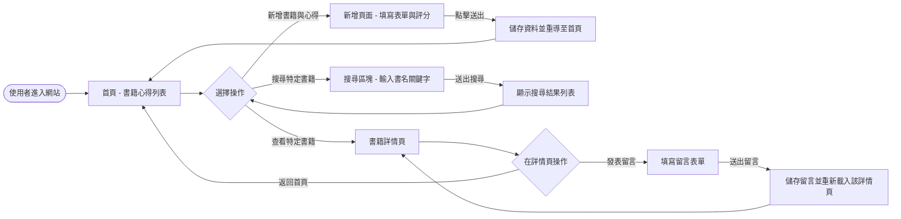
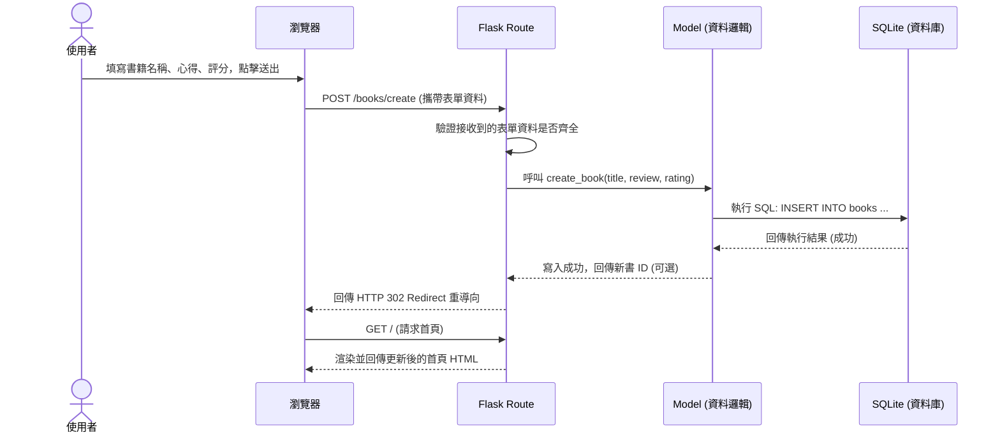

# 系統與使用者流程圖 (Flowchart)

這份文件根據 PRD 需求與系統架構，將「讀書筆記本系統」的使用者互動路徑與系統資料處理過程視覺化，幫助團隊在開發前確認邏輯順暢無遺漏。

---

## 1. 使用者流程圖 (User Flow)

此流程圖展示了使用者從進入網站開始，能夠進行的主要幾項操作（新增書籍心得、搜尋、查看詳情、發表留言等）的路徑：

---

## 2. 系統序列圖 (Sequence Diagram)

此圖以「使用者新增書籍與心得」為例，展示從使用者點擊送出表單，到資料存入 SQLite 資料庫並完成切換頁面的所有過程與系統角色互動方式：

---

## 3. 功能清單對照表

此表格列出各主要操作功能對應的 URL 路徑與使用的 HTTP 方法，做為後續開發 API、規劃路由時的實作參考：

| 功能描述 | HTTP 方法 | URL 路徑 (暫定) | 動作說明 |
| :--- | :--- | :--- | :--- |
| **首頁（書籍心得列表）** | `GET` | `/` | 瀏覽所有已登記的書籍與心得清單。 |
| **顯示「新增表單」頁面** | `GET` | `/books/create` | 顯示包含書名、心得、評分欄位的表單網頁。 |
| **處理「新增書籍」邏輯** | `POST` | `/books/create` | 接收表單送出的資料並寫入資料庫，完成後轉址回首頁。 |
| **搜尋書籍** | `GET` | `/search` 或 `/books/search` | 透過 query string (如 `?q=關鍵字`) 查詢書籍名並回傳結果列表。 |
| **查看書籍詳情與留言** | `GET` | `/books/<id>` | 顯示特定書籍的詳細心得內容以及其底下的所有留言紀錄。 |
| **處理「新增留言」邏輯** | `POST` | `/books/<id>/comments` | 接收使用者送出的留言並寫入資料庫，完成後整理並重整當前詳情頁。 |

> **備註**：這些路由可以在實作階段視開發習慣與實際需求微調，但功能對應的邏輯應保持一致。
